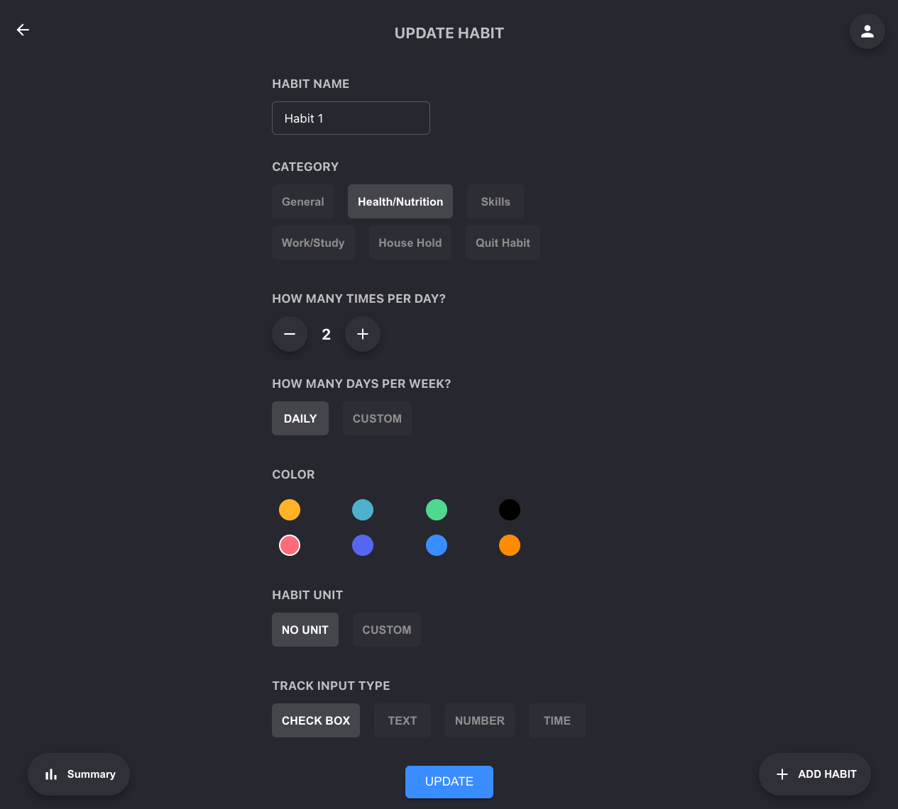

# Project live demo of HABIT TRACKER

[Click to checkout Project Live demo](https://parasvohra.github.io/habit-tracker/#/)

## HABIT TRACKER

Habit Tracker

**Tech Stack:** React.js, Node.js, MongoDB, Express.js

**Contributors:**

-   [Pursharth](https://github.com/parasVohra)

### Demo

1. Registration. User will be able to create a new account using their email and password.

     

2. Home. On home page user can see all his habits in Daily and weekly view. User can also see his streaks and work similar to snapchat streaks.

     

3. User can create new habit using create new habit form page.

    

4. User can see detailed summary of habits on Summary page.

    

5. User can edit any habit and update it of Update Habit page.

    

6. User can also see detailed stats for a habit on Summary details page.

    
